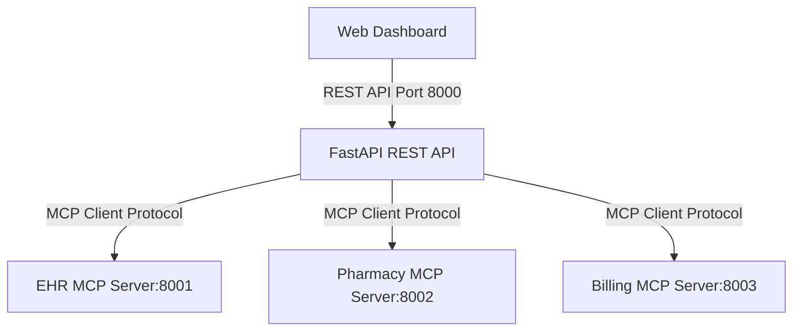
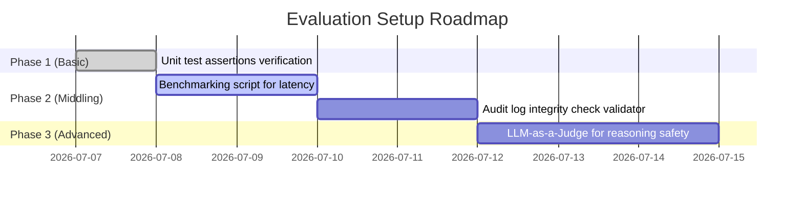

# Evaluation Framework: AI Healthcare Discharge Coordination System

This document outlines metrics and strategies to evaluate the performance, compliance, and reliability of all technical components in the system, broken down by target component and implementation complexity (Basic, Middling, Advanced).

---

## 🤖 1. AI Discharge Coordination Agent
Evaluates the decision-making, sequencing, reasoning speed, and safety of the LLM-driven/simulated workflow.

| Complexity | Evaluation Approach | Key Metrics & Benchmarks |
| :--- | :--- | :--- |
| **Basic**  *(Low Effort)* | **Static Assertion Suite** Use existing `pytest` scenarios to ensure the agent executes exactly 10 sequential workflow steps and that outcomes match deterministic targets (e.g., P001 workflow reaches step 10, P006 correctly blocks). | <ul><li>**Step Completion Rate:** (Completed Steps / Total Steps)</li><li>**Test Suite Pass Rate:** (Passed / Total Scenarios)</li></ul> |
| **Middling**  *(Moderate Effort)* | **Synthetic Perturbation Tests** Generate variations of patient EHR data (e.g., changing drug names, adding multiple allergies, or missing fields) and execute the agent workflow to evaluate route validation speed and fallback rate. | <ul><li>**Execution Latency:** Average workflow runtime (p50, p90).</li><li>**Fallback Rate:** % of workflows falling back from Live LLM to rule-based simulation.</li><li>**Token Usage:** Avg. tokens consumed per workflow.</li></ul> |
| **Advanced**  *(High Effort)* | **LLM-as-a-Judge & Adversarial Evaluation** Run a secondary evaluator model (e.g., Gemini 1.5 Pro) to grade the agent's clinical summary quality and alternative drug recommendations against medical reference standards. Inject adversarial inputs (e.g., fake drugs like "Zibramycen") to check robustness. | <ul><li>**Recommendation Safety Index:** % of suggested alternatives with zero allergy conflicts.</li><li>**Hallucination Rate:** Frequency of hallucinated drug generic classes.</li><li>**Clinical Summary Faithfulness:** Evaluator score (0.0 to 1.0) on clinical note summaries.</li></ul> |

---

## ⚡ 2. FastMCP Servers (EHR, Pharmacy, Billing)
Evaluates the latency, throughput, concurrency, and reliability of the decoupled MCP servers.

| Complexity | Evaluation Approach | Key Metrics & Benchmarks |
| :--- | :--- | :--- |
| **Basic**  *(Low Effort)* | **Tool Interface Checks** Write simple scripts that ping tool endpoints directly on ports 8001, 8002, and 8003 using the MCP protocol to verify response status and baseline schema correctness. | <ul><li>**Availability:** (Successful Pings / Total Pings)</li><li>**Schema Validation Rate:** % of responses conforming to Pydantic definitions.</li></ul> |
| **Middling**  *(Moderate Effort)* | **Load & Stress Testing** Use a tool like `Locust` or custom `asyncio`/`httpx` scripts to simulate multiple concurrent clinicians querying patient data and checking drug stock. | <ul><li>**Throughput:** Requests per Second (RPS) sustained.</li><li>**Latency Profile:** Response times under concurrency (p95, p99 limits).</li><li>**Error Rate:** % of HTTP 500/503 errors under load.</li></ul> |
| **Advanced**  *(High Effort)* | **Distributed Telemetry Instrumentation** Integrate `OpenTelemetry` middleware in FastAPI and the MCP background processes. Send metrics to Prometheus and view them on a Grafana dashboard to monitor subprocess performance and IPC (Inter-Process Communication) overhead. | <ul><li>**CPU/Memory Footprint:** Resident Set Size (RSS) per MCP daemon.</li><li>**IPC Overhead:** Network/piping latency between FastAPI client and MCP host.</li><li>**Memory Leaks:** Long-run memory consumption slope.</li></ul> |

---

## 🔒 3. Compliance Auditing & PHI Protection
Evaluates the strict boundaries of Role-Based Access Control (RBAC) and Protected Health Information (PHI) leakage prevention.

> [!WARNING]
> Ensuring billing personnel cannot access raw clinical notes and that all access attempts are audited is critical for HIPAA compliance.

| Complexity | Evaluation Approach | Key Metrics & Benchmarks |
| :--- | :--- | :--- |
| **Basic**  *(Low Effort)* | **Negative Permissive Assertions** Check that unauthorized role attempts (e.g., Role: `billing_clerk` requesting `/patient/P001` details directly) return `HTTP 403 Forbidden` and that logs record the attempt. | <ul><li>**RBAC Accuracy:** % of unauthorized requests correctly blocked.</li><li>**Log Coverage:** Checks if an audit record exists for every HTTP request.</li></ul> |
| **Middling**  *(Moderate Effort)* | **Log Integrity & Coverage Audits** Implement a validator script that parses the `audit_logs.json` file. The validator verifies event sequence timing, cryptographic integrity (ensuring no logs were tampered with/deleted), and checks for missing entries. | <ul><li>**Log Completeness Index:** (Expected Log Events / Observed Log Events).</li><li>**Audit Traceability:** Average time to trace a workflow ID to its full log trace.</li></ul> |
| **Advanced**  *(High Effort)* | **Dynamic PHI Scanner & Penetration Testing** Configure an automated tool to scan API outputs and logged values. Using regular expressions and Named Entity Recognition (NER), the scanner verifies that no unmasked PHI fields (e.g., patient name, phone number, diagnosis) leak into log entries or billing receipts. | <ul><li>**PHI Leak Count:** Total instances of unmasked PHI found in logs/receipts.</li><li>**Audit Tamper Resistance:** Speed of detecting altered timestamp fields or modified signatures.</li></ul> |

---

## 🚀 Recommended Evaluation Plan

If you want to start measuring performance immediately, we recommend setting up the **Middling Plan**:

